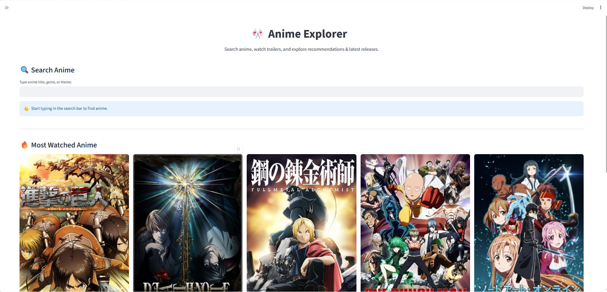
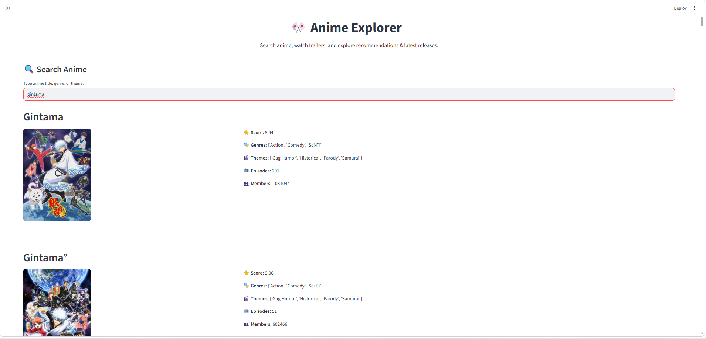
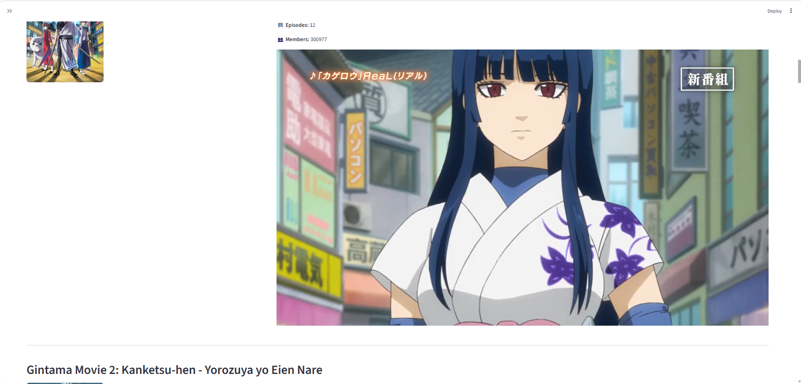

# Anime Recommendation & Search Web App

## 📌 Overview
This project is a web-based application that allows users to explore top anime, search for specific anime, and view detailed information including posters and trailers.

## 🎯 Objective
To build an interactive anime browsing platform that enhances user experience through search functionality and visual content.

## 🛠️ Technologies Used
- Python
- Streamlit 
- Pandas
- NumPy

## 🚀 Features
- 🔍 Search bar to find specific anime
- ⭐ Displays top anime recommendations
- 🖼️ Shows anime posters
- 🎬 Displays YouTube trailers
- 📊 Uses dataset for retrieving anime details

## 📊 How It Works
- Loads anime dataset
- Filters based on user input
- Displays relevant anime information dynamically
  ## 📸 Screenshots

### Home Page

### Search Functionality

### Anime Details

## 📈 Outcome
Developed an interactive and user-friendly anime application that combines data analysis with a web interface to improve content discovery.

## 📁 Dataset
Anime dataset containing titles, genres, ratings, and other relevant details.
